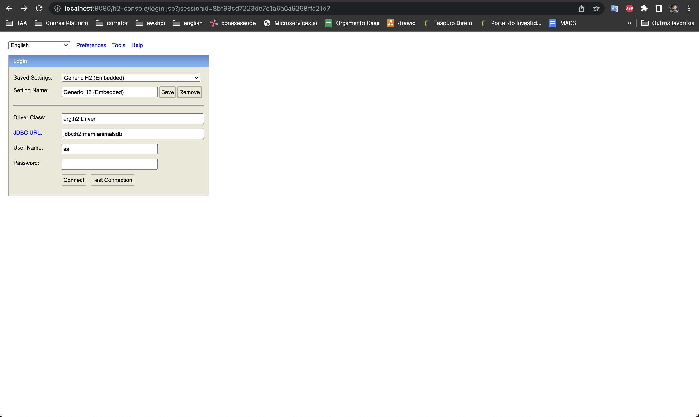
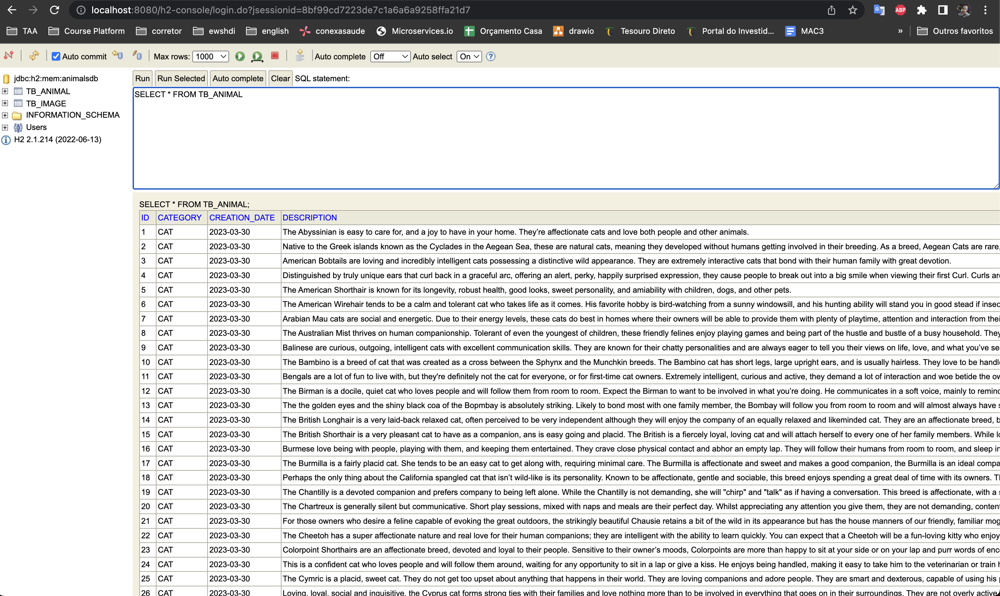
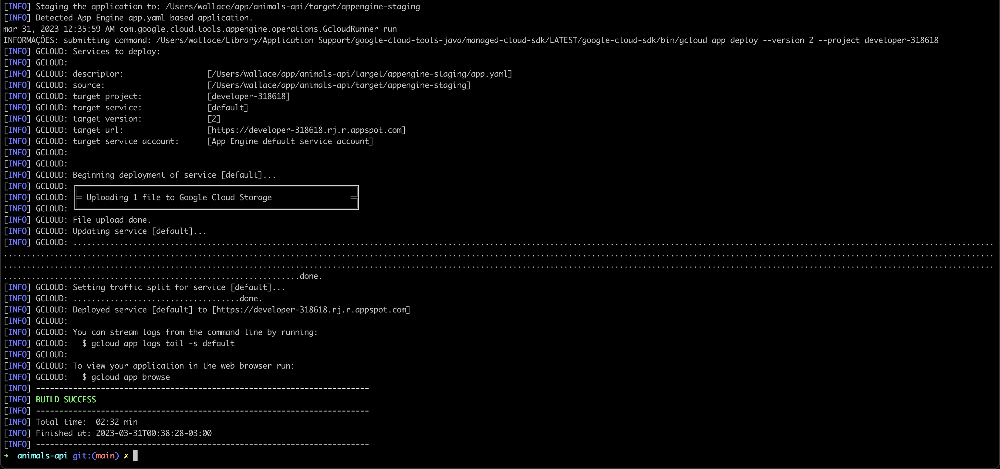
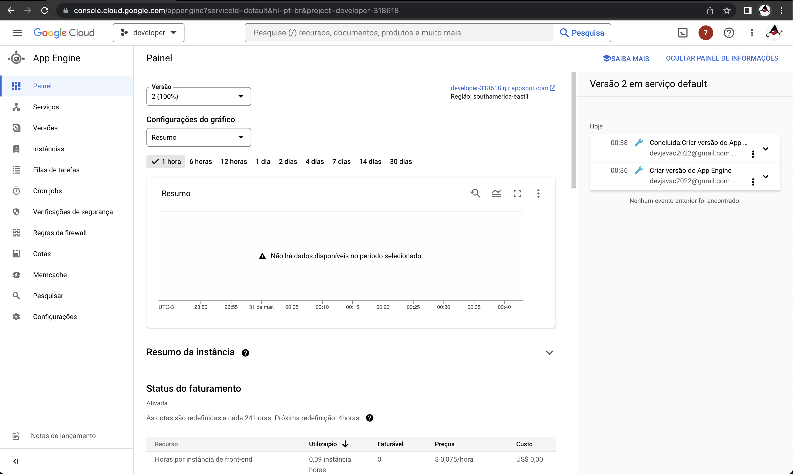
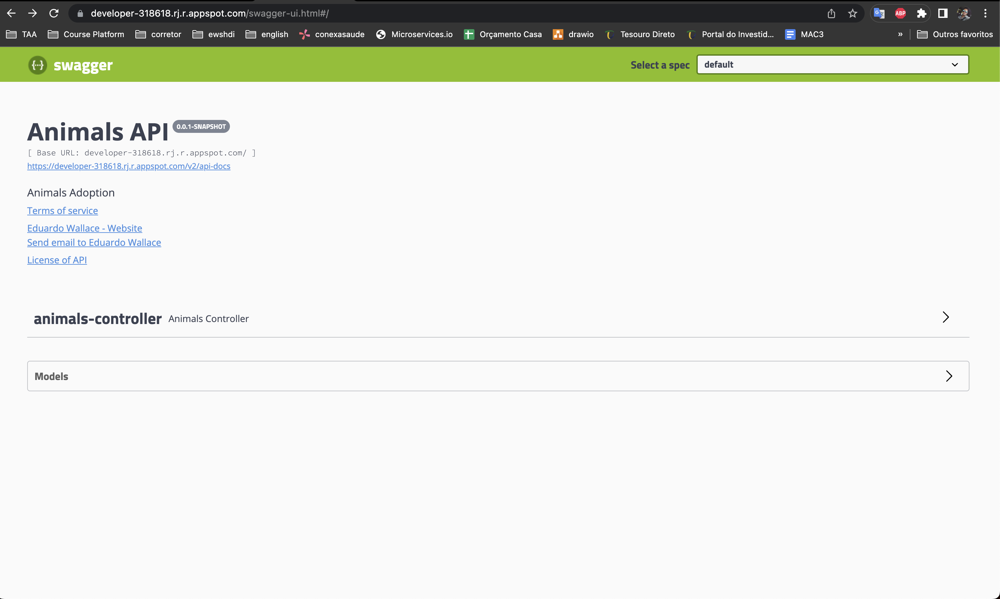

Animals API
=============

API
--

This API contains the following available services: 

- Index animals (from all partners) in the database
 ```
 curl --location --request POST 'https://developer-318618.rj.r.appspot.com/animals/indexes' \
--header 'accept: */*'
 ```
- Filter all animals by term, category, status and creation date
 ```
 curl --location 'https://developer-318618.rj.r.appspot.com/animals?term=Guardian&category=CAT&status=ADOPTED&creationDate=2023-03-30&page=0&size=10&sort=name%2Casc' \
--header 'accept: */*'
 ```
- change animal status
 ```
 curl --location --request PATCH 'https://developer-318618.rj.r.appspot.com/animals/1/status/ADOPTED' \
--header 'accept: */*'
 ```

Stacks
--

- Java 11
- SpringBoot 3
- JPA/Hibernate
- Swagger
- Junit/Mockito
- Lombok
- H2
- Spring Cloud Openfeign

H2 database
--

You can access the database in memory [here](http://localhost:8080/h2-console)






How build on Google Cloud - App Engine Provider
--

STEP 01
-----

On the terminal configure gcloud CLI :

```
gcloud init

gcloud config set project your-project-id
```

STEP 02
-----

Run the following maven command to deploy the application:

```
mvn -DskipTests package appengine:deploy
```

STEP 03
-----

Run the following command to access the application:

```
gcloud app browse
```





How to run localhost
--

STEP 01
-----

Clone the repository bellow:

```
git clone https://github.com/edubossa/animals-api.git
```

STEP 02
-----

Run the following maven command to compile the application:

```
mvn clean install
```

STEP 03
-----

Run the following command to launch the application: 

```
java -jar target/animals-api-0.0.1-SNAPSHOT.jar 
```


Swagger
--
Available [here](https://developer-318618.rj.r.appspot.com/swagger-ui.html#/)

